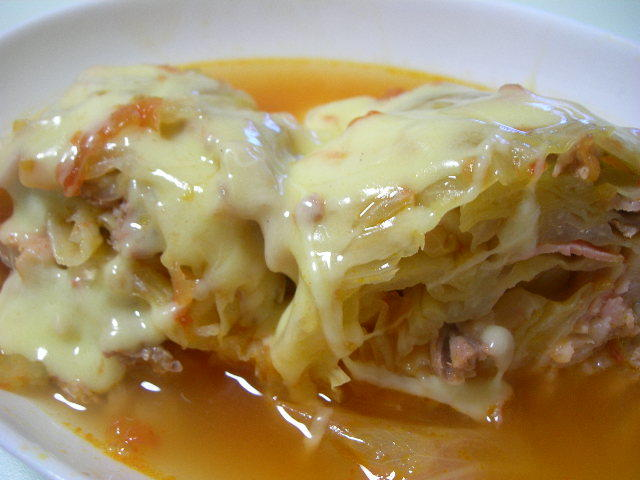

# キャベツのミルフィーユトマトチーズ

## 材料　（2人分）

* キャベツ  半玉
* 豚肉 150ｇ
* ★トマトソース又はトマト2個１缶
* ★固形コンソメ ３個
* ★酒大さじ２杯
* ★塩小さじ１杯
* ★ケチャップ大さじ3杯
* ★水700ｃｃ
* とろけるチーズ4枚
* 任意の野菜（にんじん、玉ねぎ、もやし）
>　にんじんはおいしい  

## 手順

### 1. キャベツを切る

キャベツを半玉にし、芯を切り取り、さらに半分にする。

### 2. キャベツを重ねる

外側からキャベツを1枚はがし、豚肉をのせ、  
また、はがして豚肉の上にのせて重ねてを繰り返す。  
また、一緒に入れたい具材を煮込みやすい大きさに切る。

### 3. 鍋に入れる
鍋に700ｃｃほど水を入れ(キャベツの半分以下まで)、  
そこに先ほどの肉キャベツを入れる。

### 4. 煮込む
キャベツを入れたら、★を加えてフタをして  
中火〜弱火で１５分〜２０分煮込む。  
生のトマトを使うときは2個をみじん切りにする。  
または、しんなりしたらOK。

### 5. 盛り付け
鍋から具を取り出し、盛り付ける。  
取り出したあとのスープの中にとろけるチーズスライスを入れて、  
溶け出したらオタマですくい先ほどのキャベツの上にかけて出来上がり。
> チーズも最高！
